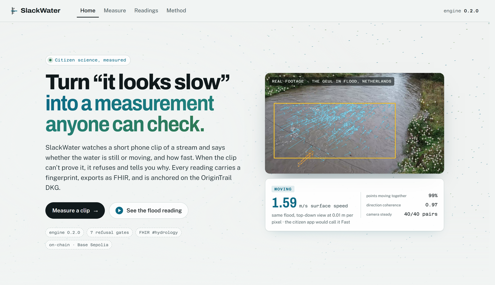
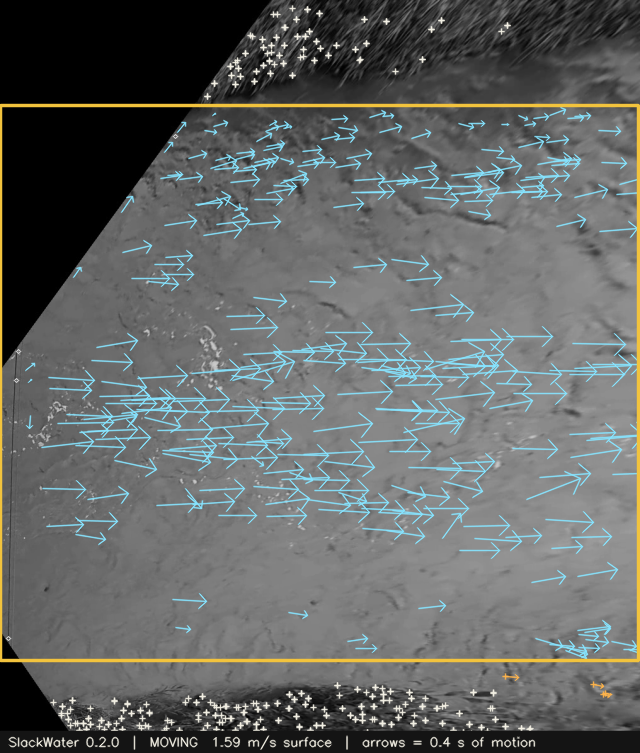
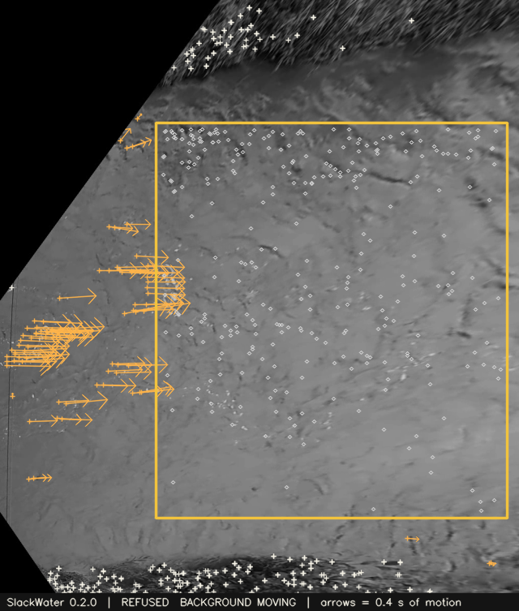
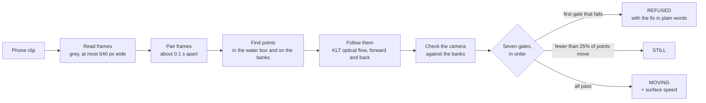
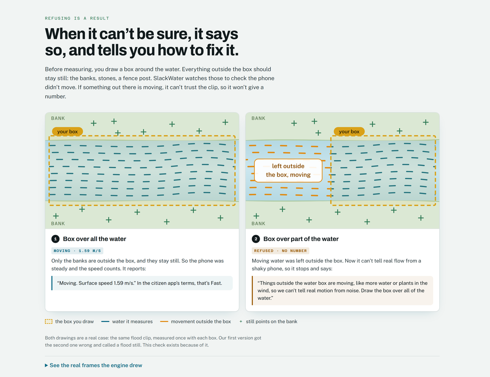
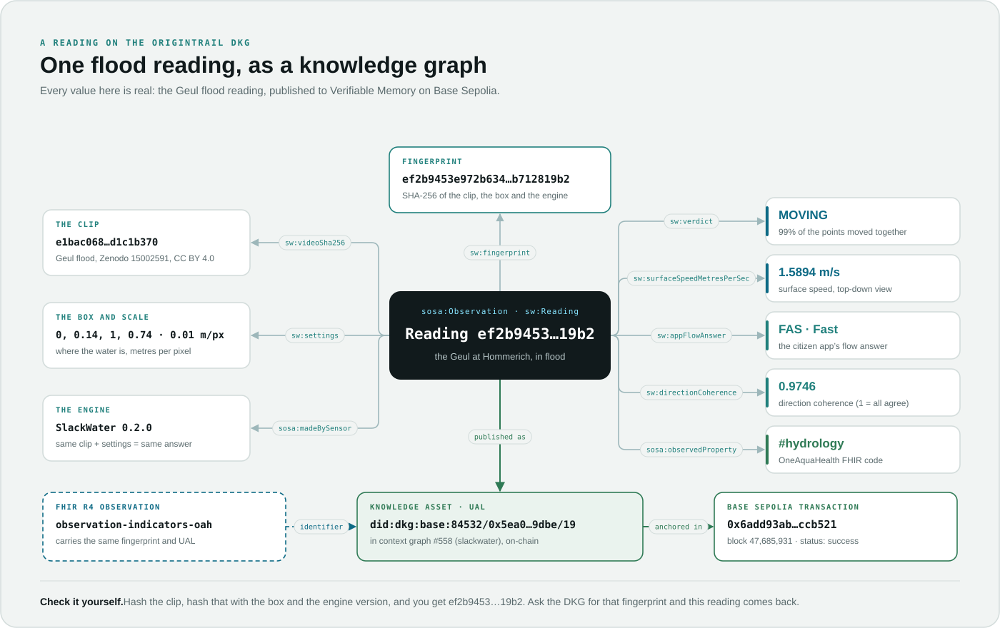
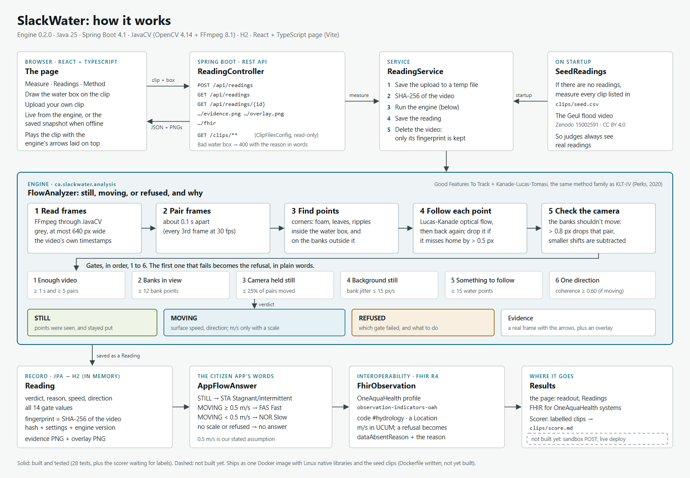

<div align="center">



# SlackWater

### Turn “it looks slow” into a measurement anyone can check.

A short phone clip of a stream goes in. Out comes **STILL**, **MOVING** with a surface speed, or a **refusal in plain words** telling the person filming how to fix the clip.<br>
Every reading carries a fingerprint, exports as **FHIR R4**, and is anchored on the **OriginTrail DKG**.


[The problem](#the-problem) · [Results](#results-on-real-footage) · [3D](#every-point-it-followed-in-3d) · [How it decides](#how-it-decides) · [Refusing is a result](#refusing-is-a-result) · [Knowledge graph](#a-record-anyone-can-check) · [Run it](#run-it)

</div>

---

## The problem

OneAquaHealth’s citizen app asks people to judge a stream’s flow by eye: **Fast, Slow, Stagnant or Dry.** Two people at the same stream can disagree. The app also asks for a short video, and nothing measures it yet.

Still water matters. It’s where the mosquitoes that carry West Nile virus lay their eggs, so knowing which stretches are really still could help crews decide where to look first.

**SlackWater measures the video.** It follows foam, leaves and ripples on the surface, checks the phone didn’t move by watching the banks, and only answers when the clip proves it.

| | By eye | SlackWater |
|---|---|---|
| Answer | “Slow, I think?” | **Moving, 1.59 m/s surface speed** |
| Evidence | none | 99% of tracked points moving together, direction coherence 0.97, 40 of 40 frame pairs with a steady camera |
| Citizen app code | a guess | `FAS` (Fast), from a stated cut-off of 0.5 m/s |
| Can someone else check it? | no | yes: the same clip and settings always give the same fingerprint, and it’s on-chain |

## Results on real footage

Real flood footage of the Geul at Hommerich, Netherlands, at the peak of a high-flow event ([Zenodo 15002591](https://zenodo.org/records/15002591), CC BY 4.0). These are the readings the live app measures when it starts.

| Clip | Verdict | Surface speed | Points moving together | Coherence | Steady pairs |
|---|---|---|---|---|---|
| Camera view, 1920×1080 | **MOVING** | 185 px/s (no scale given) | 96% | 0.93 | 40 / 40 |
| Top-down, 0.01 m per pixel | **MOVING** | **1.59 m/s** → app answer `FAS` | 99% | 0.97 | 40 / 40 |
| Top-down, box drawn too small | **REFUSED** · `BACKGROUND_MOVING` | none | | | 40 / 40 |

On a synthetic strip moving at exactly 60 px/s, the engine measures **60.000 px/s**. The flood clip has no independent reference speed, so 1.59 m/s is the engine’s answer, not a checked one. On nine more clips from Wikimedia Commons, found and labelled by Trinidad before the engine saw them: **1 right, 1 wrong, 7 refused** ([clips/score.md](clips/score.md)). Most were filmed handheld, so the banks moved and the engine refused rather than guess; one moving stream was called still, a real miss we're keeping in the score. Rerun it with `./mvnw test -Dtest=LabelledClipsScoreTest`.

<div align="center">

&nbsp;

<br>
<sub>The evidence frames the engine draws, seen from above. <b>Left:</b> the box covers the river; blue arrows show 0.4 s of motion; 1.59 m/s. <b>Right:</b> the box misses part of the river, so the moving water outside it shows orange and the reading is refused.</sub>
</div>

## Every point it followed, in 3D

Every reading keeps every point the engine tracked: foam and ripples on the water, stones and grass on the banks. The landing page draws them, one disc each (50,698 points across the three flood readings, up to 15,000 drawn per clip), and switches between three views: where each point was in the frame, its speed over time, and piled by speed. In the speed pile the banks sit at zero and the water far to the right, with the cut-off between them. That gap is the measurement.

The **3D field** (`#field`) puts every measured video in one faceted field, built on the disc engine from our earlier project StreetProof: six layouts (sequential, by video, water or bank, verdict, speed, in the frame), filters, colour by kind, verdict or speed, and a tour. Click any disc to see its video, speed, frame pair and the other points followed in the same moment, then open that video’s analysis. From any analysis, **See its points in 3D** goes the other way. A clip you upload joins the field as soon as it’s measured.

## How it decides



- **Points:** Good Features to Track in the box you draw (the water) and outside it (the banks).
- **Tracking:** pyramidal Lucas-Kanade, forward and then back. A point that misses its start by more than 0.5 px is dropped.
- **Camera check:** if the banks shift more than 0.8 px between two frames, that pair doesn’t count.
- **Noise floor:** the 90th percentile of the banks’ leftover motion. A water point only counts as moving if it beats three times that.
- **Speed:** the median of the moving points, times your scale if you give one (metres per pixel).

The same method family as KLT-IV, published river software (Perks, 2020). Every threshold below is our stated assumption, fixed per engine version, not a published standard.

| # | Gate | Passes when | Refusal | What the person filming is told |
|---|---|---|---|---|
| 1 | Readable | the video decodes | `VIDEO_UNREADABLE` | We couldn’t read this video file. |
| 2 | Enough video | ≥ 1 s and ≥ 5 frame pairs | `TOO_SHORT` | The clip is too short to measure. We need at least one second of video. |
| 3 | Banks in view | ≥ 12 fixed points outside the box | `NO_FIXED_BACKGROUND` | We can’t see enough of the bank or other fixed things outside the water box, so we can’t check whether the camera moved. |
| 4 | Camera held still | the banks moved in ≤ 25% of pairs | `CAMERA_MOVED` | The camera moved during the clip… Rest the phone on something and film again. |
| 5 | Background still | bank noise ≤ 15 px/s | `BACKGROUND_MOVING` | Things outside the water box are moving… Draw the box over all of the water. |
| 6 | Something to follow | ≥ 15 points on the water | `NOTHING_TO_TRACK` | There’s nothing on the surface we can follow… Toss a leaf or small stick in upstream and film it floating past, from the bank. |
| 7 | One direction | coherence ≥ 0.60 | `MIXED_DIRECTIONS` | The surface is moving in mixed directions. That’s usually wind or reflections, not the current, so we won’t call it. |

## Refusing is a result



Our first real clip found a way the tool could fool itself. With the box drawn over only part of the river, version 0.1 counted the moving water outside the box as background, raised its noise floor to match, and **called a flood still.** Gate 5 exists because of that clip. Now it refuses, and tells the person filming exactly what to change.

## A record anyone can check



Each reading becomes a **Knowledge Asset** in RDF, using the W3C [SOSA](https://www.w3.org/TR/vocab-ssn/) vocabulary for observations, with its observed property pointing at OneAquaHealth’s `#hydrology` code. It goes into the SlackWater context graph on the OriginTrail DKG, and the flood reading is published to Verifiable Memory on Base Sepolia:

- **UAL:** `did:dkg:base:84532/0x5ea07ffddc58dd261102746e6651747e18429dbe/19`
- **Transaction:** [`0x6add93ab…ccb521` on Basescan](https://sepolia.basescan.org/tx/0x6add93ab6a75a14d78e5074753eed2b4bc8e934f8f5f18d6865d008121ccb521)
- **Context graph:** #558, registered on-chain

<details>
<summary><b>The Knowledge Asset, in Turtle</b></summary>

```turtle
@prefix sw: <https://slackwater.dev/ns#> .
@prefix sosa: <http://www.w3.org/ns/sosa/> .
@prefix schema: <https://schema.org/> .
@prefix xsd: <http://www.w3.org/2001/XMLSchema#> .

<urn:slackwater:reading:ef2b9453e972b6348c28356988999e62f1103db41e845934ba69806b712819b2> a sosa:Observation, sw:Reading ;
  sosa:observedProperty <http://hl7.eu/fhir/ig/oah/CodeSystem/temporarySystem-oah-eu#hydrology> ;
  sosa:madeBySensor <urn:slackwater:engine:0.2.0> ;
  sw:fingerprint "ef2b9453e972b6348c28356988999e62f1103db41e845934ba69806b712819b2" ;
  sw:videoSha256 "e1bac0685b9b4bba1710eb7bba2abff615ea13066fe2813595461842d1c1b370" ;
  sw:settings "region=0.0000,0.1400,1.0000,0.7400;mpp=0.010000;max=15.0" ;
  sw:engineVersion "0.2.0" ;
  sw:verdict "MOVING" ;
  sw:surfaceSpeedMetresPerSec "1.5894"^^xsd:decimal ;
  sw:movingShare "0.9878"^^xsd:decimal ;
  sw:directionCoherence "0.9746"^^xsd:decimal ;
  sw:appFlowAnswer "FAS" ;
  schema:name "Geul at Hommerich (NL) · top-down at 0.01 m/px" .
```

Trimmed: the full asset also carries the result time, the reason in words, the pixel speed, the direction and the camera’s unstable share. Built by [`ReadingAsset.java`](src/main/java/ca/slackwater/ledger/ReadingAsset.java).
</details>

### Check it yourself, without trusting our server

The clip is deleted after measuring. Its hash proves which clip it was. Anyone with the same clip can rebuild the fingerprint in two lines:

```bash
sha256sum clips/geul/20241010_081717_ortho.mp4
# e1bac0685b9b4bba1710eb7bba2abff615ea13066fe2813595461842d1c1b370

printf 'e1bac0685b9b4bba1710eb7bba2abff615ea13066fe2813595461842d1c1b370\nregion=0.0000,0.1400,1.0000,0.7400;mpp=0.010000;max=15.0\n0.2.0' | sha256sum
# ef2b9453e972b6348c28356988999e62f1103db41e845934ba69806b712819b2
```

That is the fingerprint on the DKG. Change one byte of the video or one setting and it changes completely.

### FHIR R4, in OneAquaHealth’s own profile

`GET /api/readings/{id}/fhir` returns an Observation following the OneAquaHealth IG profile `observation-indicators-oah`, coded `#hydrology`, with the site and the engine as contained resources. The fingerprint and the DKG UAL ride along as identifiers, so a health system can follow any reading back to the public record.

```json
{
  "resourceType": "Observation",
  "meta": { "profile": ["http://hl7.eu/fhir/ig/oah/StructureDefinition/observation-indicators-oah"] },
  "identifier": [
    { "system": "urn:slackwater:fingerprint", "value": "ef2b9453e972b6348c28356988999e62f1103db41e845934ba69806b712819b2" },
    { "system": "urn:origintrail:dkg", "value": "did:dkg:base:84532/0x5ea07ffddc58dd261102746e6651747e18429dbe/19" }
  ],
  "status": "final",
  "code": { "coding": [{ "system": "http://hl7.eu/fhir/ig/oah/CodeSystem/temporarySystem-oah-eu", "code": "hydrology", "display": "Hydrology of the stream" }] },
  "valueQuantity": { "value": 1.589, "unit": "m/s", "system": "http://unitsofmeasure.org", "code": "m/s" },
  "note": [{ "text": "OneAquaHealth app answer: FAS Fast (with waves or high velocity). Surface speed 1.59 m/s, at or above our assumed cut-off of 0.5 m/s." }]
}
```

Trimmed. A refusal exports with `dataAbsentReason` and the refusal in words. Not yet run through the official HL7 validator.

## Architecture



| Layer | What | Where |
|---|---|---|
| Engine | Frame reading, KLT tracking, camera check, seven gates, evidence frames | [`analysis/`](src/main/java/ca/slackwater/analysis) |
| Readings | Spring Boot REST API, H2 database, fingerprints, FHIR export, citizen-app answer | [`reading/`](src/main/java/ca/slackwater/reading) |
| Ledger | RDF Knowledge Assets, DKG anchoring and SPARQL verification | [`ledger/`](src/main/java/ca/slackwater/ledger) |
| Page | React 19 + TypeScript + Vite: landing, measure, readings, method, and the three.js 3D field | [`frontend/`](frontend) |

The full request flow, step by step, is in [`docs/flow.png`](docs/flow.png).

## Run it

You need **Java 25**. The Maven wrapper brings Maven, and the build downloads its own Node to build the page.

```bash
./mvnw spring-boot:run
```

Open http://localhost:8080. The app measures the Geul clips on startup, so real readings are there straight away.

> `.mvn/maven.config` pins the OpenCV natives to `windows-x86_64`. On macOS or Linux, change it to your platform (for example `linux-x86_64` or `macosx-arm64`).

**Working on the page:** run the engine as above, then

```bash
cd frontend && npm install && npm run dev
```

Vite serves the page on http://localhost:5173 and forwards `/api` and `/clips` to the engine.

**Docker** (builds the Linux natives itself):

```bash
docker build -t slackwater . && docker run --rm -p 8080:8080 slackwater
```

**Tests:** `./mvnw test`. 35 tests: synthetic clips with known speeds, the real Geul footage, the API (including the points behind every reading), the seed readings and the DKG ledger. 34 pass, and the labelled-clips score is skipped until the labels file exists.

**DKG anchoring** is off by default. With an OriginTrail DKG node and its CLI installed, set `slackwater.dkg.enabled=true` (and `slackwater.dkg.context-graph` if you use your own). Readings already anchored are kept in [`clips/anchors.csv`](clips/anchors.csv), so the live site shows them without a node.

### API

| Method | Path | What it does |
|---|---|---|
| `POST` | `/api/readings` | Measure a clip (multipart: `video`, `regionX`, `regionY`, `regionWidth`, `regionHeight`, optional `metresPerPixel`, `siteName`, `latitude`, `longitude`) |
| `GET` | `/api/readings` | Every reading, newest first |
| `GET` | `/api/readings/{id}` | One reading, with its gates and anchor |
| `GET` | `/api/readings/{id}/evidence.png` | The evidence frame |
| `GET` | `/api/readings/{id}/overlay.png` | The marks alone, to lay over the playing clip |
| `GET` | `/api/readings/{id}/points` | Every point the engine followed, for the 3D views |
| `GET` | `/api/readings/{id}/fhir` | The FHIR R4 Observation |
| `GET` | `/api/readings/ledger` | Whether DKG anchoring is on, and where |
| `POST` | `/api/readings/{id}/anchor` | Anchor a reading on the DKG |
| `GET` | `/api/readings/{id}/anchor/verify` | Read it back from the DKG and compare fingerprints |

## What it never claims

- **River speed.** It measures the surface, which flows faster than the average.
- **Metres per second without a scale** in the frame.
- **Mosquitoes, larvae or disease.** It says still or moving; crews decide where to look.

## What’s next

- A thermal camera for water with nothing visible on it: turbulence shows up in infrared.
- Readings flowing into OneAquaHealth’s systems through the FHIR export.
- Every reading anchored on the DKG as it’s measured.

## Credits

- **Footage:** “Orthorectified video at Hommerich station, Geul River, The Netherlands”, [Zenodo 15002591](https://zenodo.org/records/15002591), CC BY 4.0. Unchanged; details in [`clips/CREDITS.md`](clips/CREDITS.md).
- **Method family:** KLT-IV, Perks (2020).
- **Standards:** the OneAquaHealth FHIR Implementation Guide (HL7 Europe), W3C SOSA, the OriginTrail DKG.

## Team

Built by **[Sidharth Nair](https://github.com/sidharthnair7)** and **Trinidad Laguardia**.
